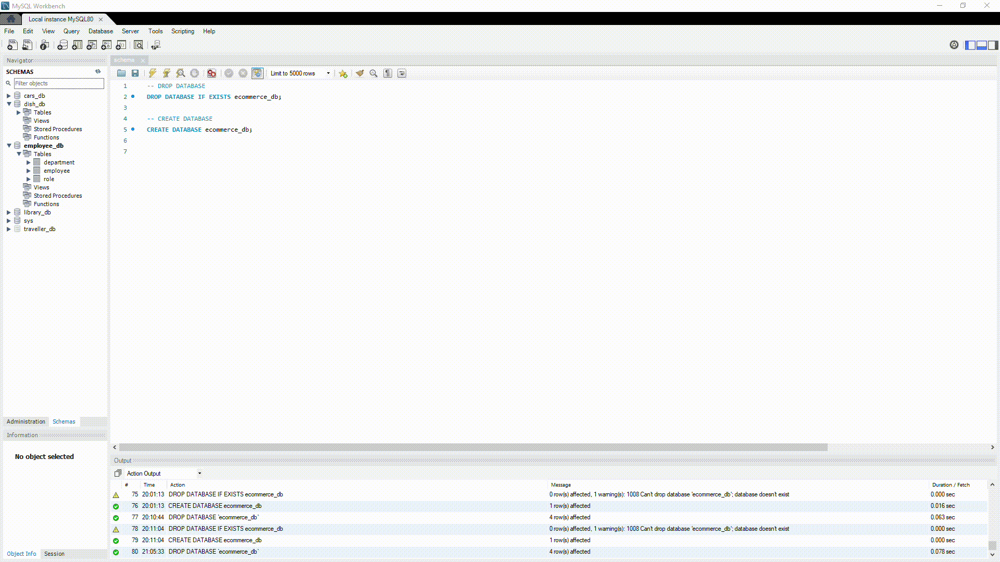
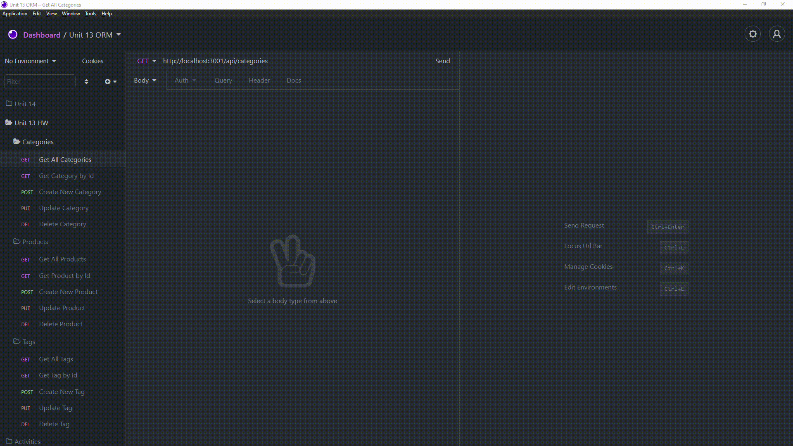

# E-Commerce Back-end Management

## Overview

For this exercise, the user uses a Object-Relational-Mapping framework, specifically Sequelize, to manage a database of consumer products from a created server. As well as creating new data, it must be able to extract, update, and delete.

## Table of Contents

1. [Pseudocode](#pseudocode)
2. [Installation](#installation)
3. [Usage](#usage)
4. [Technologies Used](#technologies-used)
5. [Links](#links)
6. [Demos](#demos)

## Pseudocode

1. Setup models to establish relationships between data.
2. Setup server and server routes.
3. Setup api routes to give the server functionality.
4. GET, POST, PUT, DELETE methods for 'Category, 'Product', and 'Tag', each having their on script file.
5. GET(finding an item by id), PUT, and DELETE will need to have an id from the request.

## Installation

1. `npm i`
2. Create or update an .env file with

   ```
    DB_NAME='ecommerce_db'
    DB_USER=root
    DB_PW=

   ```

3. Setup `schema.sql` via a [VSCode extension](https://marketplace.visualstudio.com/items?=itemName=formulahendry.vscode-mysql) or [MySql Workbench](https://www.mysql.com/products/workbench/).
4. Install [Postman](https://www.postman.com/) or [Insomnia](https://insomnia.rest/).

## Usage

1. `npm run seed` to seed the databases.
2. `npm run start` to start the server.
3. Create a GET request for all categories, using `http://localhost:{Your PORT Here}/api/categories`.
4. Create a GET request for categories by ID, using `http://localhost:{Your PORT Here}/api/categories/{ID Number Here}`.
5. Create a POST request for new categories, using `http://localhost:{Your PORT Here}/api/categories` and adding the new category via `category_name`.
6. Create a PUT request for updating categories by ID, using `http://localhost:{Your PORT Here}/api/categories/{ID Number Here}` and changing `category_name` by assigning it a new value.
7. Create a DELETE request for deleting categories by ID, using `http://localhost:{Your PORT Here}/api/categories/{ID Number Here}`.
8. Repeat the same CRUD operations for "Products" and "Tags".
9. Select the request and input the respective data to access or edit them.

## Technologies Used

- JavaScript
- SQL
- Express

## Resources

- [Object-Relational-Mappers](https://blog.bitsrc.io/what-is-an-orm-and-why-you-should-use-it-b2b6f75f5e2a?gi=99dd55e3decd)
- [Sequelize](https://sequelize.org/master/index.html)
- [Many-to-Many](https://vertabelo.com/blog/many-to-many-relationship/)
- [Eager-loading](https://sequelize.org/master/manual/eager-loading.html)

## Links

- [Folder of Higher Quality Demos](https://drive.google.com/drive/folders/1bv6FHdamzLrXrn4Cc9reYGANCow8hd38?usp=sharing)
- [Repository](https://github.com/huirayj/e-commerce-back-end)

## Demos

### Installation



### Categories



### Products


### Tags


